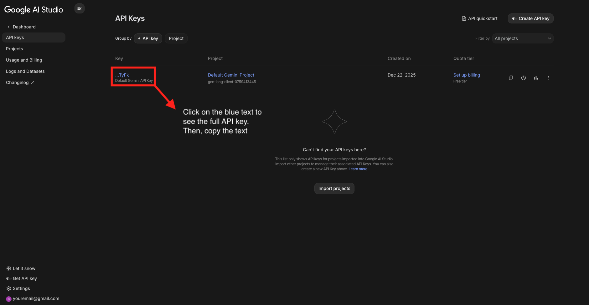

# bioRxiv digest 🧬
Automatically have papers from bioRxiv sent to your email at 8am ET, personalized to your interests. Each email also contains general trends, a general concept, and an interest-based concept so you can continue building up your knowledge.

Each email contains:

- Five papers selected based on user interests, scientific impact, and robustness
- A list of general trends extrapolated from the results of the papers
- AI explanation of a general concept from any field, meant to boost breadth knowledge
- AI explanation of a concept in user interests, meant to boost depth knowledge

This digest creates AI summaries of each paper (using Gemini) to get a brief overview of the paper. Abstracts and links to the full paper are also available for further exploration.

## Instructions
To setup the email digest, please follow the steps below

### Setting up the repository

1. Fork this repository with your GitHub account
2. Once forked, go to Settings -> General -> Danger Zone -> **Change Visibility to Private**

### Getting a Gemini API Key
To get a free Gemini API key, you need to use Google AI Studio. Make sure to keep this API key private.

1. Go to [Google AI Studio](https://aistudio.google.com/) and sign into the platform
2. Go to 'Dashboard' (find this on the left hand side panel)
3. You should have a default API key automatically given by Google. This can be used for running the digest. See the image below for getting the API key.

### Setting up Gmail routing
To enable this setting, **make sure you have 2 factor authentication enabled for the Gmail account you wish to use**.

1. Go to your [Google Account settings](https://myaccount.google.com/)
2. In the search bar, type in 'App Passwords' and select it
3. Confirm it's you through 2 factor authentication
4. Type in 'bioRxiv digest' for the App Name and enter it
5. Google will give you an app password, copy this and keep it somewhere safe

### Activating the Digest

In GitHub, go to Settings -> Security -> Secrets and variables -> Actions

To get the digest running, setup the following secrets by clicking "New repository secret"

- DIGEST_INTERESTS: what you are interested in hearing about (eg. immunology, single-cell transcriptomics, mRNA vaccines, etc.)
- EMAIL_TO: the email you want to receive the digest
- SMTP_HOST: smtp.gmail.com
- SMTP_PORT: 587
- SMTP_USER: the email you set SMTP with
- SMTP_PASSWORD: the app password Google gave to use SMTP
- GEMINI_API_KEY: the API key from Google AI Studio

Congratulations, you should be receiving an email digest every day at 8am EST!

If you feel that something is lacking, feel free to make open an issue or make a PR to the main repository.
